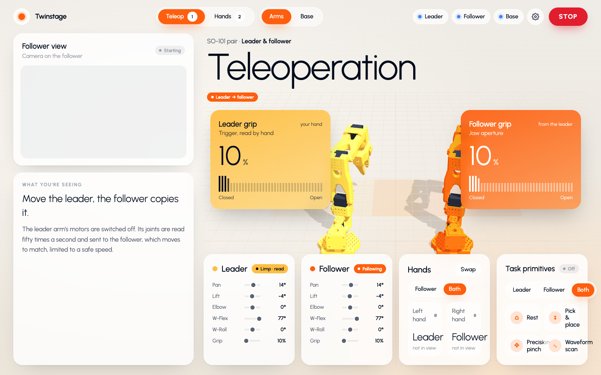

# Twinstage

Live 3D digital twins for [LeRobot](https://github.com/huggingface/lerobot) arms and bases, in the browser. Drive a pair of SO-101 arms with a leader arm, with your bare hands under a camera, or with scripted task primitives. Drive a LeKiwi base from the keyboard or your phone. The twin always shows what the hardware is doing, and nothing moves without passing the same safety guards.

**[Try it in your browser](https://charansoma3001.github.io/twinstage/)** · **[Read the docs](https://charansoma3001.github.io/twinstage/docs/)**



It was built for live demos on a big screen, and grew into the tool we use to set up and debug the arms themselves.

## What it does

- **Teleop.** Move the leader arm by hand; the follower copies it at 50 Hz.
- **Hands.** One overhead camera tracks both hands. Each hand drives one arm, with no contact and no gloves: palm position sets where the arm reaches, palm height sets how high, and thumb spread opens the gripper.
- **Task primitives.** Pick and place, precision pinch and a wave, run by one arm or mirrored on both.
- **LeKiwi base.** Drive the omniwheel base from the keyboard or a phone on the same network.
- **Setup tools.** Calibrate the table for hand tracking, and measure each arm's joint map by matching the twin to the real arm by eye.
- **Guards.** A keep-out stops the two arms meeting in the middle, checked against the arm's full body. There is also a slew limit, a watchdog, travel clamps, and one-key stop. See [safety](docs/safety.md).

## Try it without a robot

**In your browser:** <https://charansoma3001.github.io/twinstage/>. The bridge and the drivers run inside the page, simulated, so every mode works, and hands mode uses your own webcam.

**On your machine,** with the real bridge and the real drivers in dry run. You need Node.js 22.9 or later and Python 3.10 or later. Nothing else: the simulation runs the real drivers in dry-run mode, which uses only Python's standard library.

```bash
git clone https://github.com/charansoma3001/twinstage.git
cd twinstage
npm install
npm run sim
```

Open <http://localhost:8787>. Every stage mode works against simulated arms and a simulated base. Open <http://localhost:8787/settings> for the setup tools.

## Run it with hardware

The short version, for two SO-101 arms that LeRobot has already calibrated:

```bash
cp .env.example .env          # set ARM_PORT, LEADER_PORT, ARM_PYTHON
npm run build
ARM_DRY=1 npm run server      # dry run first, every time
npm run server                # live
```

Before hands mode will drive a live arm, measure its joint map in **Settings → Joint map**. [Getting started](docs/getting-started.md) walks through it from nothing, one arm at a time.

## Documentation

Also online, with a sidebar, at <https://charansoma3001.github.io/twinstage/docs/>.

| | |
|---|---|
| [Getting started](docs/getting-started.md) | From the simulation to one arm, two arms, and the base |
| [Hardware](docs/hardware.md) | SO-101 leader and follower, LeKiwi and its Pi, finding ports |
| [Modes](docs/modes.md) | Teleop, hands, primitives, the base, and what STOP and Relax do |
| [Table calibration](docs/calibration.md) | Teaching the hand tracker where the table is |
| [Joint map](docs/joint-map.md) | Matching the twin's joints to a real arm's |
| [Safety](docs/safety.md) | Every guard, its default, and what is not guarded |
| [Configuration](docs/configuration.md) | Environment variables and driver flags |
| [Architecture](docs/architecture.md) | How the browser, the bridge and the drivers fit together |
| [Protocol](docs/protocol.md) | The WebSocket and driver messages, for writing your own client or driver |
| [Adding a robot](docs/adding-a-robot.md) | What it takes to support an arm other than the SO-101 |
| [Troubleshooting](docs/troubleshooting.md) | Ports, dropped packets, cameras, networking |
| [Performance](docs/performance.md) | Measured latency, and where the time goes |

## Built with Twinstage

Built something with it, or on it? Post it in [Show and tell](https://github.com/charansoma3001/twinstage/discussions/categories/show-and-tell), and send a pull request adding it here.

## Contributing

Issues and pull requests are welcome. [CONTRIBUTING.md](CONTRIBUTING.md) covers the checks to run and how the code is laid out. This software moves real motors, so read [safety](docs/safety.md) before changing anything under `drivers/` or `server/`.

## License

[Apache 2.0](LICENSE). Use it, change it and sell it; keep the notices in [NOTICE](NOTICE). If Twinstage helps your research, [CITATION.cff](CITATION.cff) says how to cite it.
