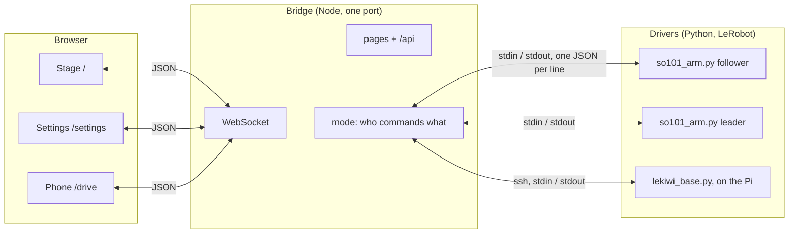

# Architecture

Three layers, each a separate process, talking in JSON.



- **The browser** does the thinking: hand tracking, retargeting, inverse kinematics, the keep-out, and drawing the twins. It sends joint angles.
- **The bridge** owns the mode and the drivers. It decides whose commands reach which arm, and it restarts a driver that dies. It does no kinematics and no unit conversion.
- **The drivers** own the hardware and every hard limit: unit conversion, travel clamps, slew, the watchdog. A driver trusts nothing it is sent. This is why a bug in a page cannot move an arm faster, or further, than the driver allows.

The drivers are children of the bridge, so they die with it, and a dead bridge cannot leave a powered arm behind. The base's driver is sent over `ssh` on every start and exits on its own if the bridge goes quiet.

## The browser demo

`npm run build:demo` builds the pages to run with no bridge at all, for GitHub Pages. They run the bridge's own modules (`server/modes.js`, `arms.js`, `base.js` and `hub.js`, which need nothing from Node) inside the page, with JavaScript ports of the drivers' dry runs in `web/src/sim/`. So the demo follows the same mode rules, refusals and drive ownership as a real bridge. Each tab runs its own. In teleop, the simulated leader moves by itself, since nobody is holding it.

## Units at each boundary

| Where | Arm joints are |
|---|---|
| Browser, and browser to bridge | URDF radians, six values, gripper included (its joint angle, 0 to 1.745 rad) |
| Bridge to driver | the same, passed through |
| Driver to LeRobot | LeRobot's calibrated degrees, through the [joint map](joint-map.md), and the gripper as 0 to 100% |
| Leader to follower, in teleop | LeRobot degrees, straight across, so no map is involved |

## The code

```
web/                     the pages, built by Vite
  index.html             the stage
  settings.html          settings
  public/                URDFs and meshes, MediaPipe's model, the phone drive page
  src/
    stage/               the stage: state, view, drive, paint, messages, hands, twin, keepout
    ui/                  the shared design system (theme.css) and scene look
    settings*.js ...     the settings page: steps, calibration, joint-map tool, sandbox
    config.js            the SO-101's geometry and limits, measured off its URDF
    kinematics.js        the analytic inverse kinematics
    retarget.js          camera image to table to arm target
    so101.js, urdf.js    loading, mounting and posing the URDF
    so101Body.js         the arm's physical extent, for the keep-out
    so101-hull.json      generated: npm run build:hull
    bridge.js            the WebSocket client both pages use
    jointMap.js          model <-> arm joint conversion
  test/                  Vitest, including sweeps against the real URDF and meshes
server/                  the bridge
  index.js               wiring and the WebSocket
  config.js              environment
  modes.js               the mode state machine
  arms.js, base.js       driver supervision
  driver.js              newline-JSON child processes
  http.js                pages and /api
  test/                  unit tests and an end-to-end dry run
drivers/                 Python, run by the bridge
  so101_arm.py           one SO-101, follower or leader
  lekiwi_base.py         the LeKiwi wheels
  jog.py, scan.py        joint-map fallback, read-only bus scan
  tests/                 pytest, in dry run
scripts/                 build-so101-hull.mjs
```

## Why the browser does the kinematics

Hand tracking already runs in the browser, and the twin needs the same joint angles the arm gets. Solving once, where both are needed, means the twin shows exactly what was sent. The bridge stays a small, testable pipe, and the driver stays the one place limits are enforced.
